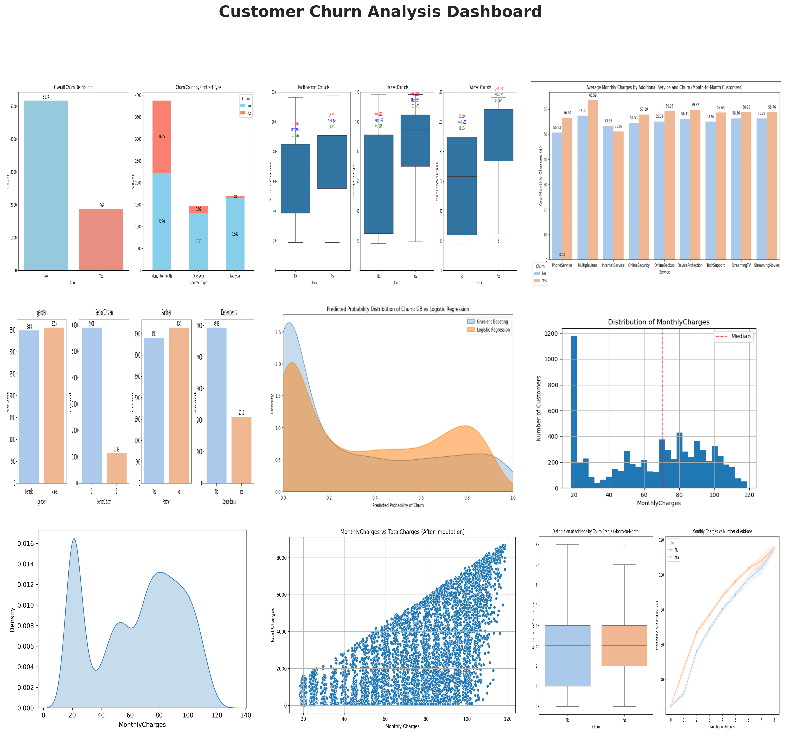
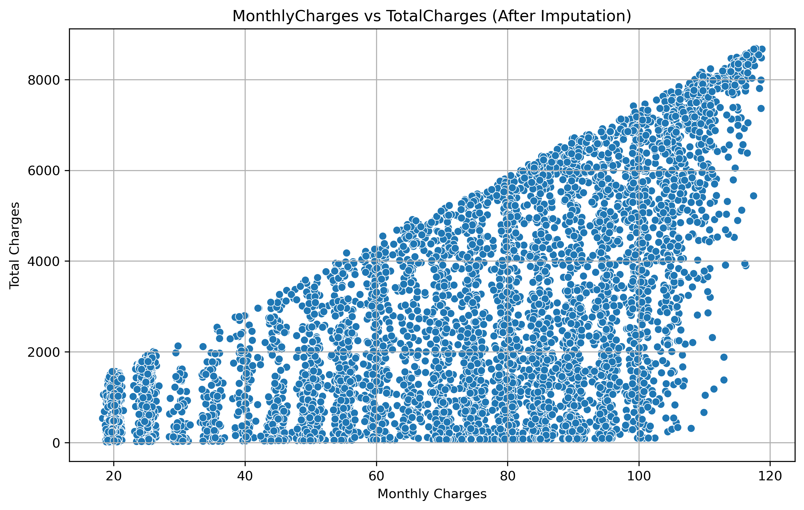
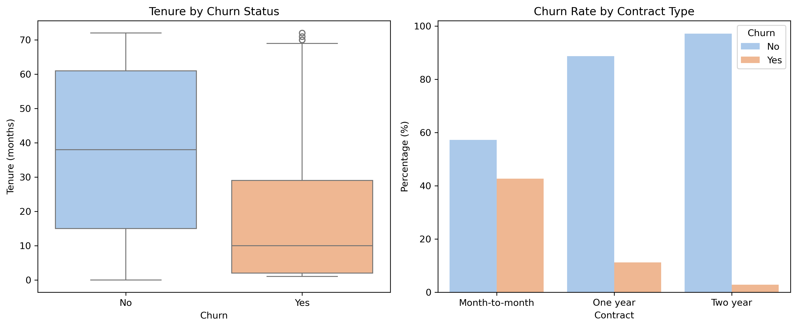
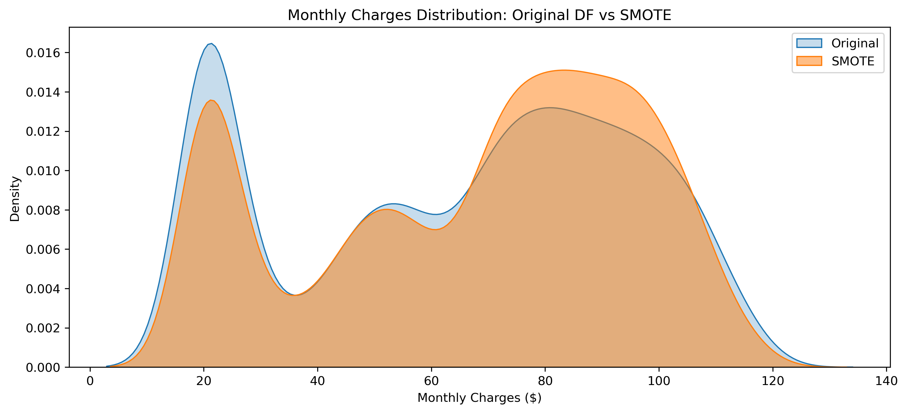
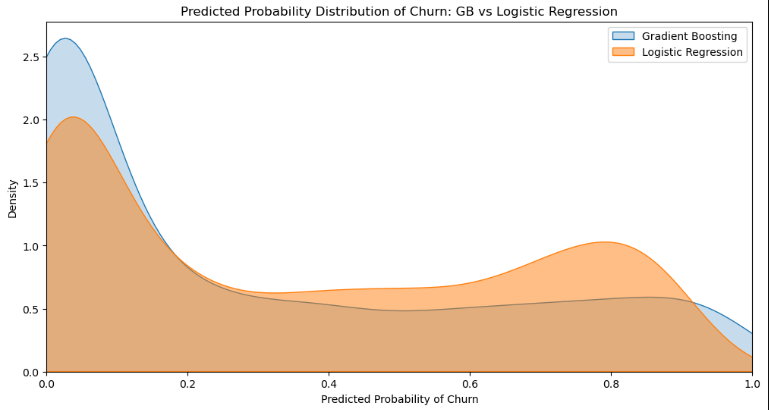

# 📊 Telco Customer Churn Analysis - Complete Walkthrough

### 📋 Dashboard View


## 📋 Project Overview

This project analyzes customer churn patterns for a telecommunications company using the Telco Customer Churn dataset from Kaggle. The goal is to understand churn drivers and build predictive models to identify at-risk customers.

**Dataset Source**: [Kaggle - Telco Customer Churn](https://www.kaggle.com/datasets/blastchar/telco-customer-churn/data)  
**Original Data**: IBM Sample Data Sets  
**Total Records**: 7,043 customers  
**Features**: 21 columns including demographic, service, and billing information

---

## 🎯 Business Context (Documented in Kaggle)

Predict customer behavior to develop focused retention programs by analyzing:
- Services each customer has signed up for
- Customer account information (tenure, contract, payment method)
- Demographic information
- Monthly and total charges

---

## 🔍 Data Understanding & Preprocessing

### Initial Data Assessment
- **Total Columns**: 20 features + target variable (Churn)
- **Missing Values**: 11 records in `TotalCharges` & `Tenure`
- **Data Type Issues**: `TotalCharges` stored as object instead of numerical

### Churn Distribution
- **Overall Churn Rate**: ~27% (imbalanced classification problem)
- **Contract-wise Churn Analysis**:

| Contract Type | Total Customers | Churned | Not Churned | Churn Rate |
|---------------|----------------|---------|-------------|------------|
| Month-to-month | 3,875 | 1,655 | 2,220 | ~43% |
| One year | 1,473 | 166 | 1,307 | ~11% |
| Two year | 1,695 | 48 | 1,647 | ~3% |

**Key Insight**: Month-to-month contracts show significantly higher churn rates, indicating data leakage risk if not handled properly.

### Missing Value Imputation Strategy

**Root Cause Analysis**: Missing values in `TotalCharges` occurred for customers with zero tenure (new customers not yet billed) - MNAR (Missing Not At Random) pattern.

**Imputation Approach**:
- Used median values due to high variability in monthly charges
- **One year contracts**: Median = $68.75
- **Two year contracts**: Median = $64.45
- Calculated `TotalCharges` = `Tenure` × `MonthlyCharges` for null records

**Validation**: Post-imputation scatter plots showed maintained data distribution integrity.



---

## 📊 Exploratory Data Analysis

### Demographic Insights


**Findings**:
- Most customers are younger individuals without dependents
- Equal gender distribution
- Balanced marital status distribution

### Financial Analysis by Contract Type


**Key Discovery**: Among month-to-month customers, churners consistently pay higher monthly charges than loyal customers. Even the cheapest 25% of churners (Q1) pay more than 50% of loyal customers.

### Hypothesis Testing

#### Hypothesis 1: Additional Services Drive Churn
**Assumption**: Churners pay more due to additional services


**Conclusion**: ❌ Contradicted  
Churners do have slightly more add-ons, but the difference isn't extreme enough to fully explain higher charges. Pricing structure appears reasonable.

#### Hypothesis 2: Short Tenure & Flexible Contracts Increase Churn
**Assumption**: Shorter tenure and month-to-month contracts lead to higher churn



**Conclusion**: ✅ Supported  
- Churners have significantly shorter tenure
- Month-to-month contracts show highest churn probability
- Long-term contracts effectively reduce churn

#### Hypothesis 3: Payment Method Correlates with Churn
**Assumption**: Certain payment methods increase churn risk


**Findings**:
- Electronic check: Highest churn rate (53.7%)
- Bank transfer & credit card (automatic): Lower churn (~34%)
- Mailed check: Lowest churn (31.6%) but smaller user base

**Conclusion**: ❌ Partially Contradicted  
Payment method alone doesn't fully explain churn patterns. Manual payments don't necessarily correlate with higher churn.

---

## 🤖 Machine Learning Modeling

### Data Preparation
- **Categorical Encoding**: LabelEncoder for all categorical variables
- **Class Imbalance Handling**: SMOTE oversampling technique
- **Train-Test Split**: 70-30 split with stratification

### SMOTE Validation


**Validation Result**: SMOTE maintains original data distribution while balancing classes, making it safe for modeling.

### Model Comparison

Four models evaluated:
1. Logistic Regression
2. Random Forest
3. Gradient Boosting
4. XGBoost

#### Performance Metrics

| Model | Accuracy | F1 Score | ROC-AUC |
|-------|----------|----------|---------|
| Logistic Regression | 0.768 | **0.623** | 0.827 |
| Random Forest | **0.782** | 0.609 | 0.831 |
| Gradient Boosting | 0.774 | 0.619 | **0.836** |
| XGBoost | 0.777 | 0.617 | 0.834 |

### Model Selection Rationale

**Gradient Boosting Chosen** because:
- Highest ROC-AUC (0.836) - best at ranking churn risk
- Maintains good F1 score balance
- Excellent for identifying high-risk customers for retention campaigns

### Probability Analysis


**Gradient Boosting Characteristics**:
- Clear separation between low-risk (near 0.1) and high-risk (near 0.9) customers
- Confident predictions enable precise targeting
- Better risk ranking capability

**Logistic Regression Characteristics**:
- More conservative probability estimates
- Clustered around 0.2-0.8 range
- Less decisive for extreme cases

---

## 💡 Key Business Insights

### 1. High-Risk Customer Profile
- **Contract**: Month-to-month
- **Tenure**: Short-term (recent customers)
- **Payment**: Electronic check users
- **Charges**: Higher monthly billing tiers

### 2. Retention Opportunities
- Focus on month-to-month customers in early tenure period
- Encourage automatic payment methods
- Develop targeted offers for high-value at-risk customers

### 3. Model Deployment Value
Gradient Boosting provides clear customer segmentation:
- **Low-risk (0.1 probability)**: Minimal retention effort needed
- **High-risk (0.9 probability)**: Priority for retention campaigns
- **Medium-risk**: Monitor and nurture relationships

---

## 🚀 Recommendations

### Immediate Actions
1. **Targeted Campaigns**: Focus retention efforts on month-to-month customers paying above median charges
2. **Payment Incentives**: Encourage automatic payment methods with small discounts
3. **Early Intervention**: Implement welcome programs for new month-to-month customers

### Strategic Initiatives
1. **Contract Benefits**: Highlight advantages of longer contracts to month-to-month customers
2. **Service Bundling**: Create attractive bundles to increase value perception
3. **Proactive Outreach**: Use model predictions for pre-emptive retention efforts

### Monitoring & Improvement
1. **Model Retraining**: Quarterly model updates with new data
2. **Feature Enhancement**: Incorporate customer service interaction data
3. **A/B Testing**: Validate retention strategy effectiveness

---
*Report generated from comprehensive churn analysis workflow. Last updated: $(22-10-2025)*

## 📁 Project Structure

```bash
├── Notebooks/01_null_value_imputation_walkthrough.ipynb
├── Notebooks/02_customer_churn_exploration_walkthrough.ipynb
├── Notebooks/03_EDA.ipynb
├── Notebooks/SmoteDataComparision.ipynb
├── Notebooks/Plots/ (All visualization assets)
└── Dataset/ (Processed data and model outputs)
└── Notebooks/ModelsProboScore/(Model outputs confidence on each prediction GB/LR)
---
